<script type="text/javascript" async src="https://cdn.mathjax.org/mathjax/latest/MathJax.js?config=TeX-MML-AM_CHTML"></script>

The above line is just to support the display of mathematical formulas, it is recommended to open with **Chrome**.

# transfer_learning

The project about transfer learning.

And the machine parameters used are as follows：

| CPU             | 内存 | 显卡         |
| --------------- | ---- | ------------ |
| i7-5930K (6/12) | 128G | GTX 1080 * 4 |

(Also read codes of other algorithm, but some try it myself, others are not. )


## Non-deep transfer learning

### TCA

Download the data set of Office-31, the input format is `.mat` (if it is not, please use Matlab to convert it). 

You can see the result with the command: `python TCA.py`.

The results is as follows:

(**The accuracy is up to 91.08%**)

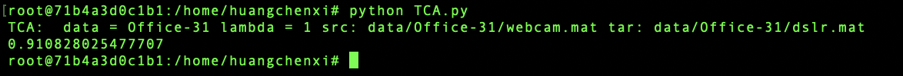


### JDA

I used the data set provided by the author Long Mingsheng source code. 

10 common categories are picked out from 4 datasets of object images: `caltech, amazon, webcam, and dslr`. Then follow the previously reported protocols for preparing features, i.e., extracting SURF features and quantizing them into an 800-bin histogram with codebooks computed via K-means on a subset of images from amazon. 
The file name: `*_SURF_L10.mat` is about features and labels.

------

I write two version of the JDA.
One is the code of *Long Mingsheng*'s' MATLAB version of the code. According to the structure of the paper, after the reappearance, the results are as follows:

 (**The best accuracy is 79.62%,** about webcam and dslr; but **the worst accuracy is 24.76%**, about webcam and caltech. And except `A->W` and `A->D`, all are better than 1 NN.)

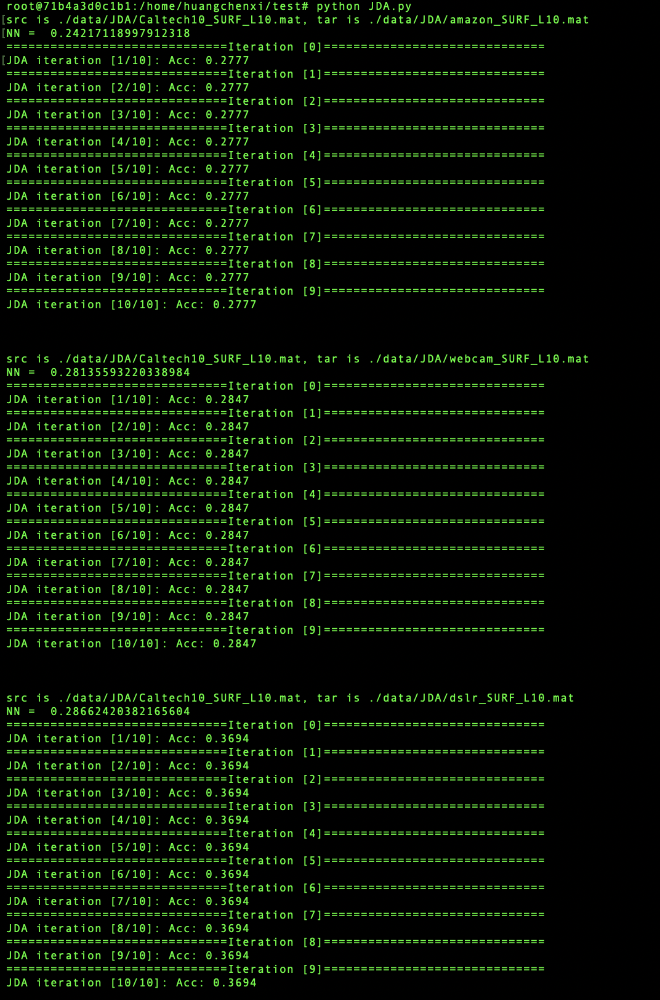

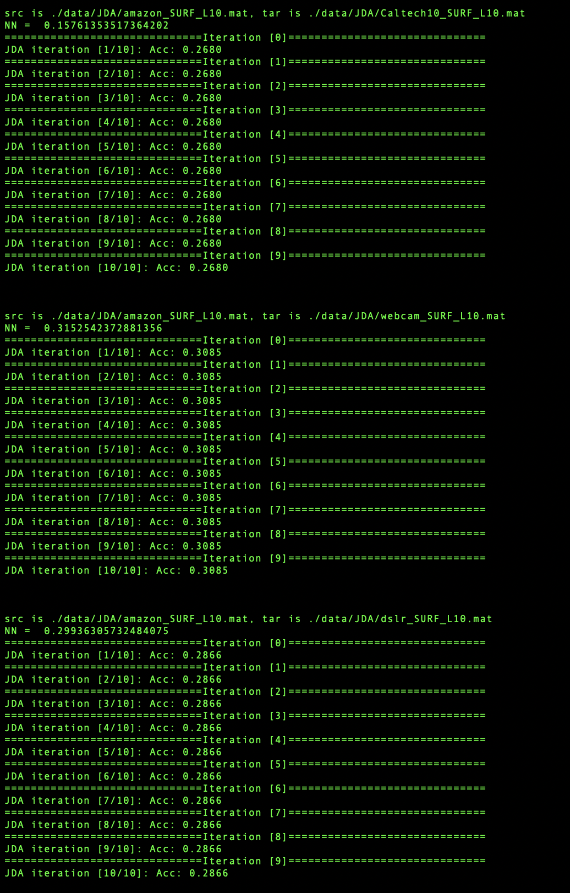

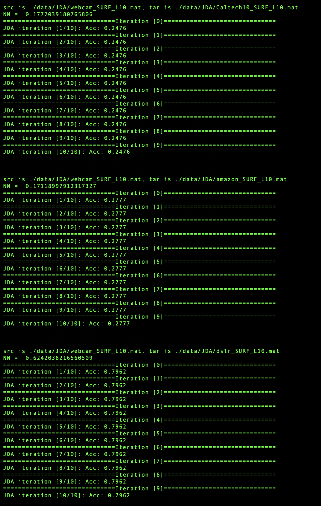


First, I think the low accuracy due to my programming, but after I see the paper result, it may because the data or algorithm.

The best in paper is `D->W = 89.49`, and in my test is `W->D = 79.62`(and `D->W =73.85% `).

The worst in paper is `W->C = 31.17%`, and in my test is `W->C = 24.76%`.

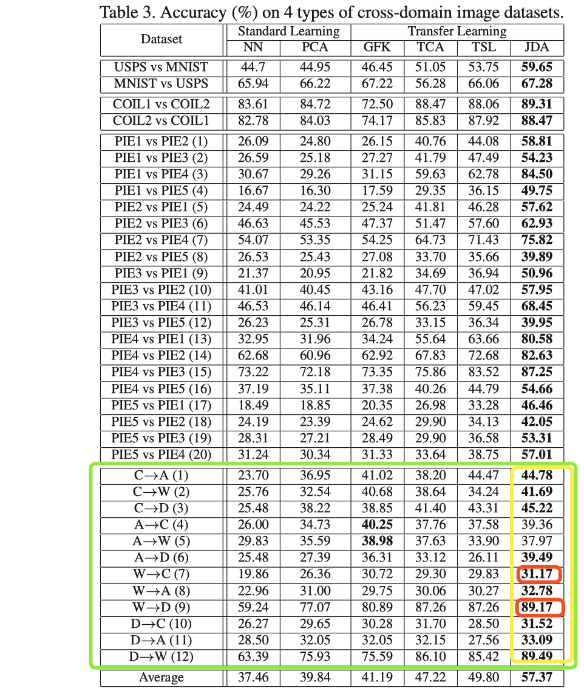

------

The other is *Wang Jindong*'s Python version of the code. He changed the structure of the code, reduced the function call, converted to a loop, and used the data already obtained in the previous loop, avoiding the recalculation. Therefore, the error is also reduced. The results are as follows:

(**The accuracy is 46.56%** about caltech and amazon. And in last version is only 27.78%, in paper is 44.78%)


## Deep transfer learning

### ResNet50

The datasets are the same.

The structure of ResNet50 is as follows:

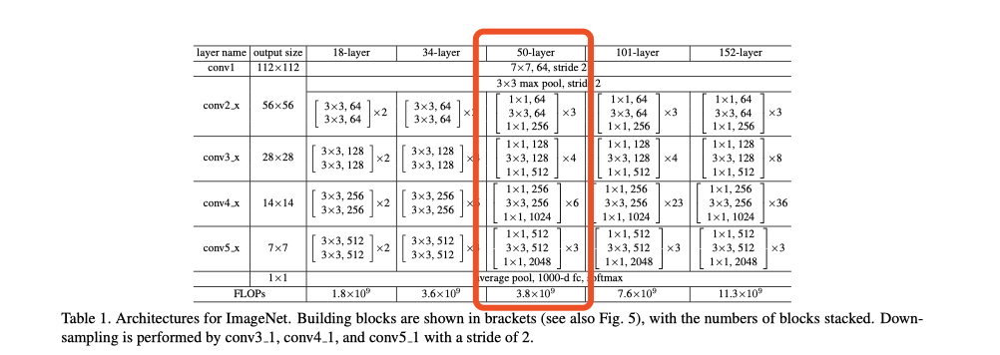

We can build it layer by layer according to its structure; it can also be used `torchvision.models.resnet50(pretrained=False, progress=True, **kwargs)`. I choose the latter, and use the pertained parameters (the parameters are in `./codes/ResNet50/resnet50-19c8e357.pth`, you can use it).

But the images is so large and I first set the `batches_size = 256`. So the docker stop, and then I forced the container size as 8 GB and decreased the batches size to 100.

And the part of the result as follows:

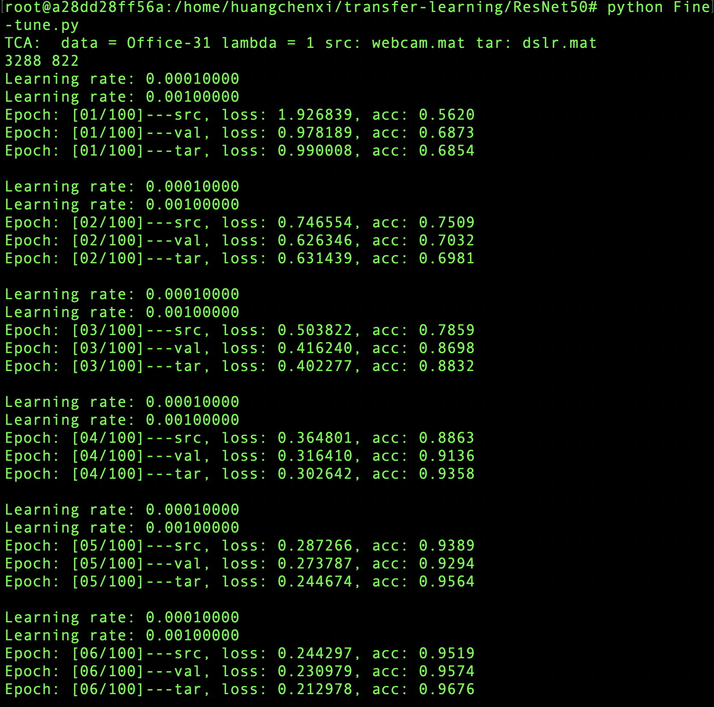

Obviously, the accuracy is increase. And only after 4 iteration, the target accuracy can be up to 93.58%. So, the network is good. And you can set up the batches size as 10, also can even lower.


### Digit Network

After reading Appendix D of "Self-Ensembling for Visual Domain Adaptation". I began to reproduce his digital migration network. I chose the simplest one. That is, the transfer learning from MNIST to USPS is realized. Its network structure is set as follows:

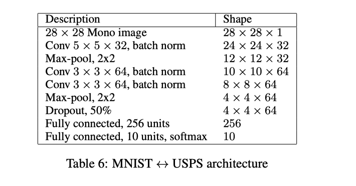

The code of network are as follows:

``` python
def __init__(self, n_classes):
  			self.conv1_1 = nn.Conv2d(1, 32, (5, 5))
        self.conv1_1_bn = nn.BatchNorm2d(32)
      
        self.pool1 = nn.MaxPool2d((2, 2))

        self.conv2_1 = nn.Conv2d(32, 64, (3, 3))
        self.conv2_1_bn = nn.BatchNorm2d(64)

        self.conv2_2 = nn.Conv2d(64, 64, (3, 3))
        self.conv2_2_bn = nn.BatchNorm2d(64)

        self.pool2 = nn.MaxPool2d((2, 2))

        self.drop1 = nn.Dropout()

        self.fc3 = nn.Linear(1024, 256)

        self.fc4 = nn.Linear(256, n_classes)
```

And the result is:

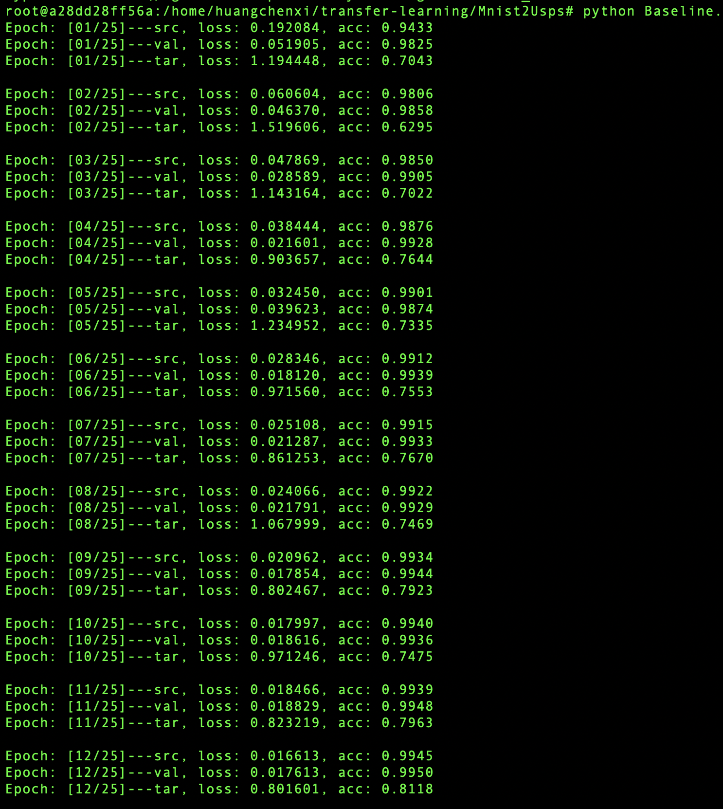

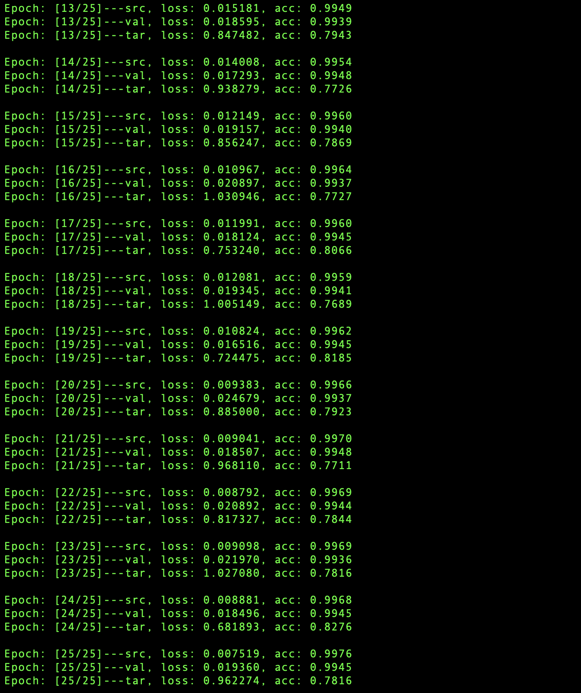


### Self-ensemble Visual Domain Adapt Master

First you need to install some packages, such as batchup, skimage. 

* When installing batchup, if you use `pip install batchup`, if the version is too high to prevent installation, you can use` pip install batchup==0.1.0. `
* When installing skimage, the command is `pip install scikit-image`; If the problem of timeout still occurs, modify the image source.

The main highlight of the code is the addition of **Confidence threshodling** and **class balance loss**, and the addition of **data enhancements** based on Mean Teacher and Temporal Ensembling. Where `TRAIN clf loss `is the loss of training classification, and `unsup(tgt)` is the loss of the target under unsupervised conditions. You can see that the test results **are close to the supervised** way.

The input information as follows:

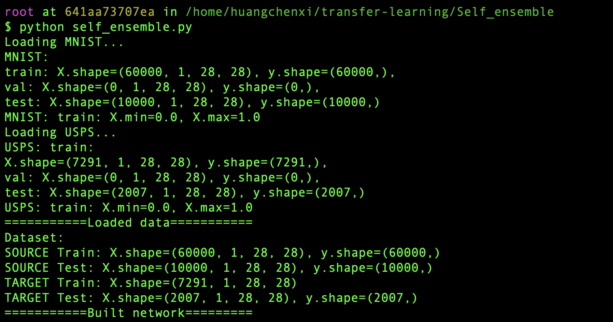

And the training result as follows:

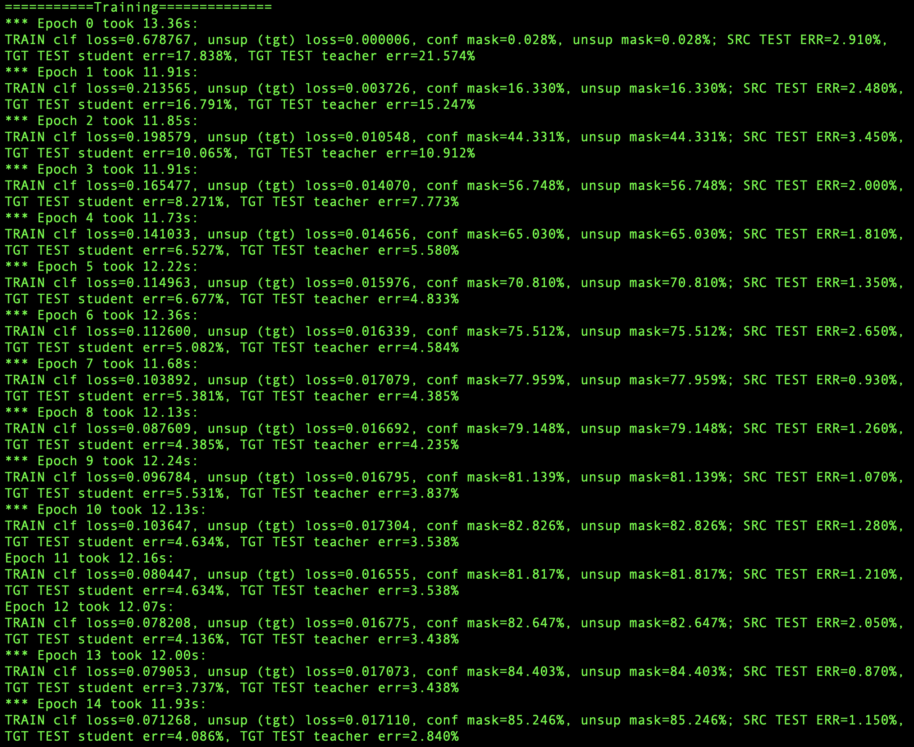

And so on. The numbers are fluctuating, but the overall results are good

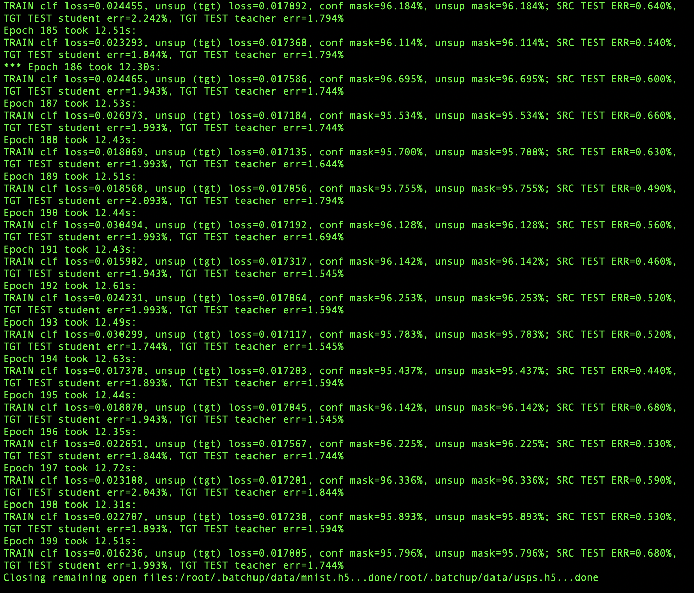

After 200 epochs, the result is really good.

Obviously, the loss is smaller, and you can see the target loss in unsupervised  is so small that can even be same with supervised.

### Domain Adversarial Training of Neural Networks

The data set should first convert and preprocessed by the [SVMlight toolkit](https://blog.csdn.net/thither_shore/article/details/53027657) .
According to the algorithm of the shallow NN, I did `5.1.5 Proxy Distance-Figure 3`, tested the four combinations:

* whether there is 
* whether there is an experiment with mSDA

The Shallow NN is:

> Algorithm: Shallow DANN – Stochastic随机 training update
>
> 输入：
>
> 1. 样例
>
>    $S=(x_i,y_i)^n_{i=1},T=(x_i)^{n'}_{i=1}$
>
> 2. 隐藏层大小$D$
>
> 3. 适应层参数$\lambda$
>
> 4. 学习率$\mu$
>
> 输出：神经网络$\{W,V,b,c\}$
>
> $W,V\leftarrow \text{random_init}(D)$
>
> $b,c,u,d\leftarrow 0$
>
> while stopping criterion is not met do
>
> ​	for i from 1 to n do
>
> ​			// 前向传播
>
> ​			$G_f(x_i)\leftarrow sigm(b+Wx_i)$
>
> ​			$G_y(G_f(x_i))\leftarrow softmax(VG_f(x_i)+c)$		
>
> ​			// 后向传播
>
> ​			$\Delta_c\leftarrow (e(y_i)-G_y(G_f(x_i)))$
>
> ​			$\Delta_V\leftarrow \Delta_cG_f(x_i)^T$
>
> ​			$\Delta_b\leftarrow(V^T\Delta_c)\odot G_f(x_i)\odot(1-G_f(x_i))$
>
> ​			$\Delta W\leftarrow \Delta_b\cdot(x_i)^T$
>
> ​			//从当前域域适应正则化
>
> ​			$G_d(G_f(x_i))\leftarrow sigm(d+u^TG_f(x_i))$
>
> ​			$\Delta_d\leftarrow\lambda(1-G_d(G_f(x_i)))$
>
> ​			$\Delta_u\leftarrow\lambda(1-G_d(G_f(x_i)))G_f(x_i)$
>
> ​			$\text{tmp}\leftarrow\lambda(1-G_d(G_f(x_i)))\times u\odot G_f(x_i)\odot (1-G_f(x_i))$
>
> ​			$\Delta_b\leftarrow \Delta_b+tmp$
>
> ​			$\Delta_W\leftarrow \Delta_W+tmp\cdot(x_i)^T$
>
> ​			//从其他域域适应正则化
>
> ​			$j\leftarrow \text{uniform_integer}(1,\dots , n')$
>
> ​			$G_f(x_j)\leftarrow sigm(b+Wx_j)$
>
> ​			$G_d(G_f(x_j))\leftarrow sigm(d+u^TG_f(x_j))$
>
> ​			$\Delta_d\leftarrow \Delta_d-\lambda G_d(G_f(x_j))$		
>
> ​			$\Delta_u\leftarrow \Delta_u-\lambda G_d(G_f(x_j))G_f(x_j)$
>
> ​			$\text{tmp}\leftarrow-\lambda G_d(G_f(x_j))\times u\odot G_f(x_j)\odot (1-G_f(x_j))$			
>
> ​			$\Delta_b\leftarrow \Delta_b+tmp$
>
> ​			$\Delta_W\leftarrow \Delta_W+tmp\cdot(x_j)^T$
>
> ​			//更新神经网络内部参数
>
> ​			$W\leftarrow W-\mu\Delta_W$
>
> ​			$V\leftarrow V-\mu\Delta_V$
>
> ​			$b\leftarrow b-\mu\Delta_b$
>
> ​			$c\leftarrow c-\mu\Delta_c$
>
> ​			//更新域分类器
>
> ​			$u\leftarrow u-\mu\Delta u$
>
> ​			$d\leftarrow d-\mu\Delta d$
>
> ​	end for
>
> end while

And the code for the shallow NN is in `DANN.DANN.fit()`.

The data set is `Office-31-Amazon`, the source domain is `DVD`, the target The domain is `electronics`. At the same time, each group has a set of comparisons, whether the `PAD-agent distance method` is used.
Three types of training loss, verification loss, and test loss were calculated. 

The results are as follows:

* With mSDA

  * Without adversarial

    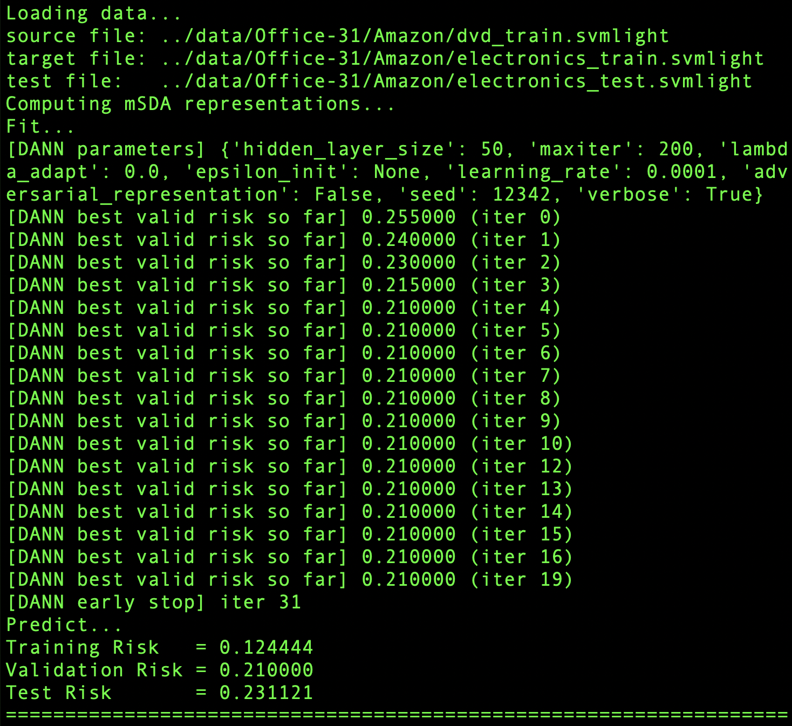

    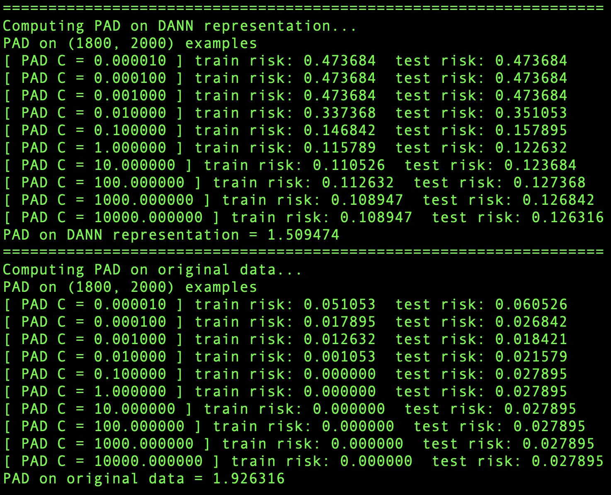

  * With adversarial

    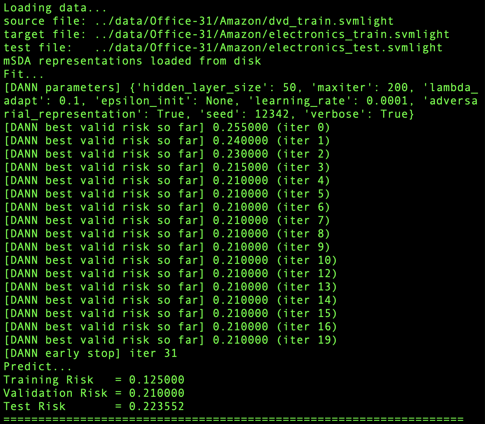

    

* Without mSDA

  * Without adversarial

    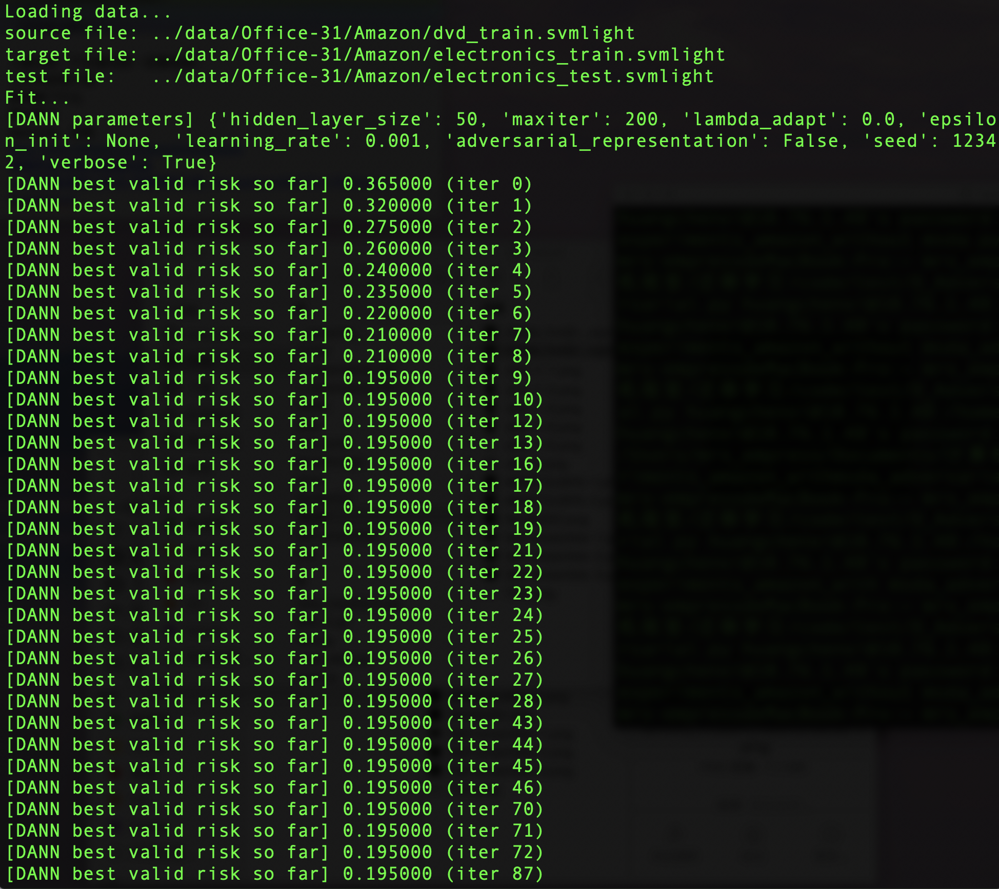

    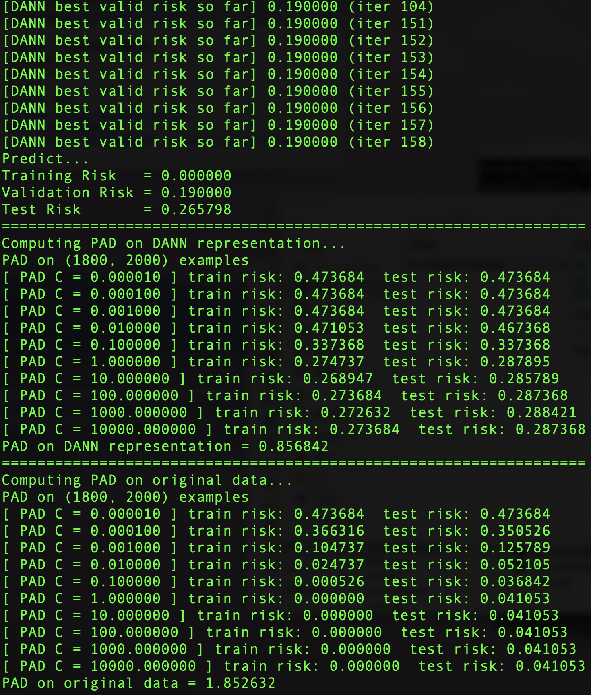

  * With adversarial

    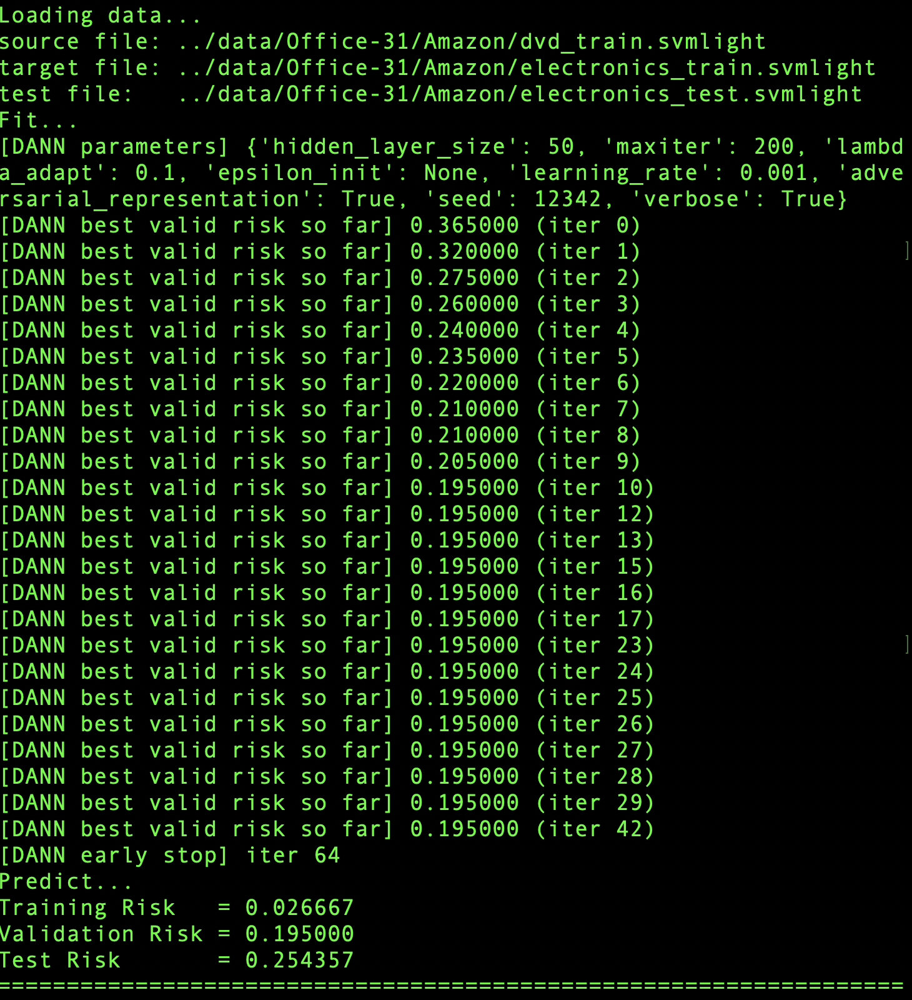

    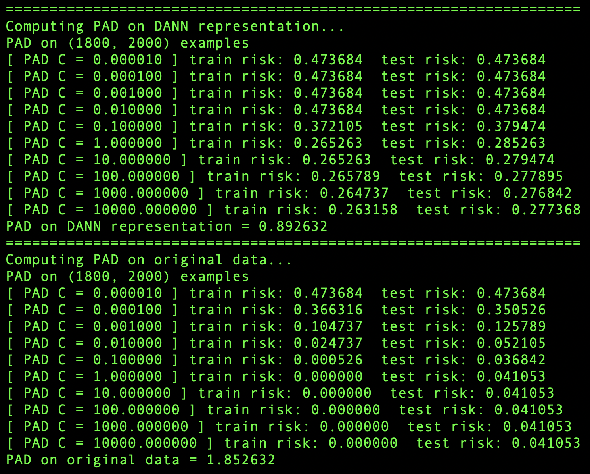

Let's look at the results in tabular form for comparison.

|              |                      | Without adversarial | With adversarial |
| ------------ | -------------------- | ------------------- | ---------------- |
| With mSDA    | Training Risk        | 0.124444            | 0.125000         |
|              | Validation Risk      | 0.210000            | 0.210000         |
|              | Test Risk            | 0.231121            | 0.223552         |
|              | PAD on DANN          | 1.509474            | 1.381053         |
|              | PAD on original data | 1.926316            | 1.926316         |
|              | Iteration numbers    | 19                  | 19               |
|              |                      |                     |                  |
| Without mSDA | Training Risk        | 0.000000            | 0.026667         |
|              | Validation Risk      | 0.190000            | 0.195000         |
|              | Test Risk            | 0.265798            | 0.254357         |
|              | PAD on DANN          | 0.856842            | 0.892632         |
|              | PAD on original data | 1.852632            | 1.852632         |
|              | Iteration numbers    | 158                 | 42               |

> In paper: D->E
>
> DANN on Original data: $\approx1.25$
>
> DANN & NN with 100 hidden neurons: $\approx0.6$
>
> DANN on mSDA representation: $\approx1.0$

First we can see that mSDA can accelerate the process of convergence and also can increase PAD. (PAD is a metric estimating the **similarity** of the source and the target representations. )

In the absence of mSDA and no adversarial, although there is no error in the training set, in the test set, the error is relatively large and there is a tendency to overfitting. 

In these four cases, **when there is both mSDA and confrontation,** the effect is best. The convergence speed is fast and the test results are good.

But at the same time, we can also see that there is no difference of more than 0.02 between the test results in the four cases. Therefore, it also illustrates **the generalization of DANN**. And its design is simple and can be attached to many previous models to improve performance.


