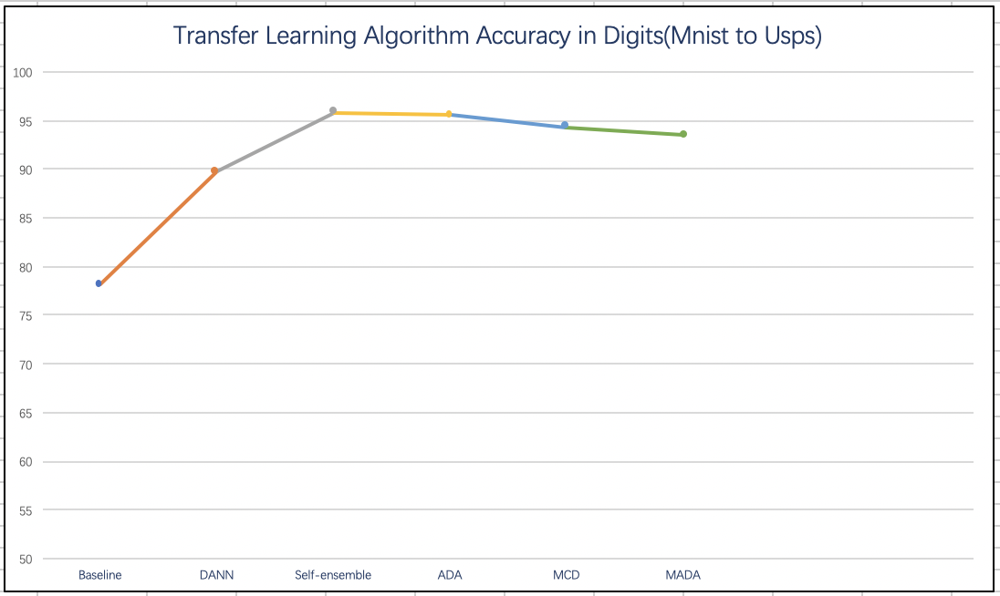
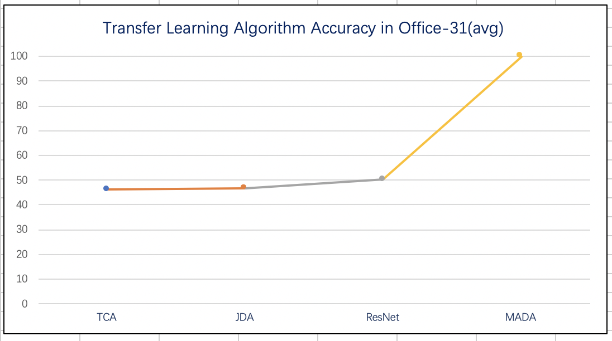
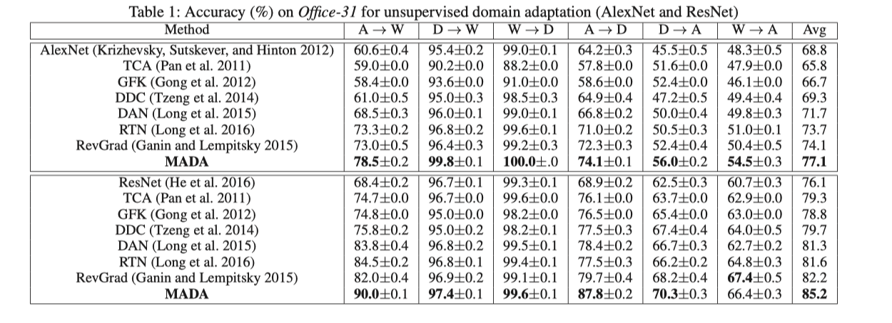

# Transfer Learning Results


This is a recurring report of the transfer learning experiment, ten in total, including **TCA, JDA, Baseline: ResNet50, Baseline: Digit Network, Self-ensemble Visual Domain Adapt Master, DANN, ADA, MCD_UDA, MADA and ResNet+Wasserstein.**


<script type="text/javascript" async src="https://cdn.mathjax.org/mathjax/latest/MathJax.js?config=TeX-MML-AM_CHTML"></script>

~~The above line is just to support the display of mathematical formulas(may be it doesn't appear)~~, it is recommended to open with **Chrome**.


[Data set](https://pan.baidu.com/s/1RuwxCrwFVjE6SFnt-LHWsA) (downloaded from all over, and integrate by my. The extraction code: zhgy)


You can use `python main.py --model='xxx' --source='xxx' --target='xxx'` to run them. And other parser you can find in `python main.py --h`


<p align="right">黄晨晰  Chenxi Huang</p>
<p align="right">Computer and science majors</p>
<p align="right">Email: mrsempress98@gmail.com / hcx_98@163.com </p>
<p align="right">Web: http://mrsempress.top</p>
<div STYLE="page-break-after: always;"></div>
[TOC]

<div STYLE="page-break-after: always;"></div>

## Preface

The machine parameters used are as follows：

| CPU             | 内存 | 显卡         |
| --------------- | ---- | ------------ |
| i7-5930K (6/12) | 125G | GTX 1080 * 4 |

I also read codes of other algorithm. And some codes try them myself, others are not. 

Each one gives ways to execution, as well as attention. At the same time, while giving the results, the analysis was carried out, including the comparison with the previous algorithm, paper, and the analysis of different data sets (You can see the part of `Compare`). 

**Attention:**

1. **[Record]** Due to space limitations, the experimental group released by each algorithm is limited. If you want to see more results of each group, see the `./results_image/*.png` .
2. **[Use log]** Since the way the data was previously recorded is directly output, then the screenshot shows. But the later the algorithm, the larger the amount of data, the more iterations, so it is not convenient for screenshots. I want to record by log, but it takes time to retest it. So I only give the code, if you want to get the data, please run it again. And you can find the log in `./results/model_name/source_to_target/model_name.csv`.
3. **[Input]** If you still have problems with the input, you can open the `main.py` file and use a basic example on each model.
4. **[Gpu]** Note that the default value of my gpu here is `3`, if you use the machine GPU does not have 4 blocks, you need to specify when entering the command.

<div STYLE="page-break-after: always;"></div>

## Summary


**Transfer Learning Algorithm Accuracy in Digits(Mnist to Usps):**

(Baseline's network is only used for specific MNIST to USPS according to Appendix D of "Self-ensembling Visual Domain Adapt Master", so the last comparison used Mnist to USPS without average.)



<div STYLE="page-break-after: always;"></div>


**Transfer Learning Algorithm Accuracy in Office-31(avg):**

(Beacause Office-31 more large, fewer days I have to experiment than others and more kinds of experiments I do, so only test  four algorithm in Office-31.)




The experiment is as same trend as the theory. And details show in `Compare`, you can see the results of each set of comparisons

<div STYLE="page-break-after: always;"></div>
## Non-deep transfer learning

### TCA

Download the data set of Office-31, the input format is `.mat` (if it is not, please use Matlab to convert it). 

~~You can see the result with the command: `python TCA.py`.~~

Since I integrated the code, please use `python main.py --model='TCA'` and you can set other parameters.

The results is as follows:

(**The accuracy is up to 91.08%**)

`Webcam to Dslr`


After the unified framework, the test by default (changed a set of source and target domains, but the results are still in the normal range):

`Amazon to Webcam`


#### Compare 

Since the paper's experiments were based on `Cross-domain WiFi Localization` and `Cross-domain Text Classification`, so I used another paper "Transfer Feature Learning with Joint Distribution Adaptation" to verify: 

(Because I **add fine-tune**, so the result will **be better than paper**. You can see more detailed information in `/results_image/TCA-x-y.png` .)

| Dataset | In paper(%) | In my test (%) |
| ------- | ----------- | -------------- |
| C->A    | 44.47       | **45.62**      |
| C->W    | 34.24       | **39.32**      |
| C->D    | 43.31       | **45.86**      |
| A->C    | 37.58       | **42.03**      |
| A->W    | 33.90       | **40.00**      |
| A->D    | 26.11       | **35.67**      |
| W->C    | 29.83       | **31.52**      |
| W->A    | 30.27       | **30.48**      |
| W->D    | 87.26       | **91.08**      |
| D->C    | 28.50       | **32.95**      |
| D->A    | 27.56       | **32.78**      |
| D->W    | 85.42       | **87.46**      |


### JDA

I used the data set provided by the author Long Mingsheng source code. 

10 common categories are picked out from 4 datasets of object images: `caltech, amazon, webcam, and dslr`. Then follow the previously reported protocols for preparing features, i.e., **extracting SURF features** and quantizing them into an 800-bin histogram with codebooks computed via K-means on a subset of images from amazon. 
The file name: `*_SURF_L10.mat` is about features and labels.

I write two version of the JDA.

#### Refer to Long's

One is the code of *Long Mingsheng*'s' MATLAB version of the code. According to the structure of the paper, after the reappearance, the results are as follows:

 (**The best accuracy is 79.62%,** about webcam and dslr; but **the worst accuracy is 24.76%**, about webcam and caltech. And except `A->W` and `A->D`, all are better than 1 NN.)


##### Compare

First, I think the low accuracy due to my programming, but after I see the paper result, it may because the data or algorithm.

The best in paper is `D->W = 89.49`, and in my test is `W->D = 79.62`(and `D->W =73.85% `).

The worst in paper is `W->C = 31.17%`, and in my test is `W->C = 24.76%`.


|      | In my test(NN) | In paper(NN) | In my test(JDA) | In paper(JDA) |
| ---- | -------------- | ------------ | --------------- | ------------- |
| C->A | 24.22          | 23.70        | 27.77           | **44.78**     |
| C->W | 28.14          | 25.76        | 28.47           | **41.69**     |
| C->D | 28.66          | 25.48        | 36.94           | **45.22**     |
| A->C | 15.76          | 26.00        | 26.80           | **39.36**     |
| A->W | 31.53          | 29.83        | 30.85           | **37.97**     |
| A->D | 29.94          | 25.48        | 28.66           | **39.49**     |
| W->C | 17.72          | 19.86        | 24.76           | **31.17**     |
| W->A | 17.12          | 22.96        | 27.77           | **32.78**     |
| W->D | 62.42          | 59.24        | 79.62           | **89.17**     |
| D->C | 8.37           | 26.27        | 28.50           | **31.52**     |
| D->A | 10.44          | 28.50        | 27.66           | **33.09**     |
| D->W | 10.85          | 63.39        | 73.56           | **89.49**     |

It seems that this reappearance is not good enough, and the gap is a bit big. The first reason is that the data itself is processed and loses some information; Another reason is that matlab is converted to python, and may not use a better function.

------

#### Refer to Wang's

The other is *Wang Jindong*'s Python version of the code. He changed the structure of the code, reduced the function call, converted to a loop, used the data already obtained in the previous loop, avoiding the recalculation, and add fine-tune. Therefore, the error is also reduced and **is similiar with that in paper**. The results are as follows:

(**The accuracy is 46.56%** about caltech and amazon. And in last version is only 27.78%, in paper is 44.78%)


##### Compare

And the summary in tables:

|      | In my test | In paper  |
| ---- | ---------- | --------- |
| C->A | **46.56**  | 44.78     |
| C->W | 39.32      | **41.69** |
| C->D | **47.13**  | 45.22     |
| A->C | **40.16**  | 39.36     |
| A->W | **38.30**  | 37.97     |
| A->D | 36.94      | **39.49** |
| W->C | **32.41**  | 31.17     |
| W->A | **32.99**  | 32.78     |
| W->D | **92.36**  | 89.17     |
| D->C | **32.06**  | 31.52     |
| D->A | **33.82**  | 33.09     |
| D->W | **89.83**  | 89.49     |

<div STYLE="page-break-after: always;"></div>
###### Compare with TCA

It can be seen that **JDA is basically better than TCA** (it is good in the paper, probably because the degree of fine-tune is different).

|      | In my test(JDA) | In paper(JDA) | In my test(TCA) | In paper(TCA) |
| ---- | --------------- | ------------- | --------------- | ------------- |
| C->A | **46.56**       | 44.78         | 45.62           | 44.47         |
| C->W | 39.32           | **41.69**     | 39.32           | 34.24         |
| C->D | **47.13**       | 45.22         | 45.86           | 43.31         |
| A->C | 40.16           | 39.36         | **42.03**       | 37.58         |
| A->W | 38.30           | 37.97         | **40.00**       | 33.90         |
| A->D | 36.94           | **39.49**     | 35.67           | 26.11         |
| W->C | **32.41**       | 31.17         | 31.52           | 29.83         |
| W->A | **32.99**       | 32.78         | 30.48           | 30.27         |
| W->D | **92.36**       | 89.17         | 91.08           | 87.26         |
| D->C | 32.06           | 31.52         | **32.95**       | 28.50         |
| D->A | **33.82**       | 33.09         | 32.78           | 27.56         |
| D->W | **89.83**       | 89.49         | 87.46           | 85.42         |

<div STYLE="page-break-after: always;"></div>
## Deep transfer learning

### ResNet50

The datasets are the same.

The structure of ResNet50 is as follows:


We can build it layer by layer according to its structure; it can also be used `torchvision.models.resnet50(pretrained=False, progress=True, **kwargs)`. I choose the latter, and use the pertained parameters (the parameters are in `./codes/ResNet50/resnet50-19c8e357.pth`, you can use it).

But the images is so large and I first set the `batches_size = 256`. So the docker stop, and then I forced the container size as 8 GB and decreased the batches size to 100.

And the part of the result as follows:


Obviously, the accuracy is increase. And only after 4 iteration, the target accuracy can **be up to 93.58%**. So, the network is good. And you can set up the batches size as 10, the loss can even lower.

#### Compare

Since this part directly calls the function, it does not look at the paper that presented it. So no comparison with paper is made. But with the accuracy of non-deep networks, ResNet has a good performance.

|      | In my test |
| ---- | ---------- |
| C->A | 49.27      |
| C->W | 38.51      |
| C->D | 49.39      |
| A->C | 39.33      |
| A->W | 38.24      |
| A->D | 38.36      |
| W->C | 38.30      |
| W->A | 38.51      |
| W->D | 96.76      |
| D->C | 38.39      |
| D->A | 38.39      |
| D->W | 98.42      |


##### With Wasserstein

Replaced the metrics and replaced MMD with Wasserstein. 

Compared with the original form of the original GAN, WGAN only changed four points:

* The last layer of the discriminator removes sigmoid
* The loss of the generator and discriminator does not take the log
* Each time the parameters of the discriminator are updated, their absolute values are truncated to no more than a fixed constant c
* Do not use momentum-based optimization algorithms (including momentum and Adam), recommend RMSProp, SGD.

The results as follows:


Relatively speaking, the rate is very fast at first, but after many iterations, the accuracy is little lower(May be the dataset is too small).


### Digit Network

After reading Appendix D of "Self-Ensembling for Visual Domain Adaptation". I began to reproduce his digital migration network. I chose the simplest one. That is, the transfer learning from MNIST to USPS is realized. Its network structure is set as follows:


The code of network are as follows:

``` python
def __init__(self, n_classes):
  			self.conv1_1 = nn.Conv2d(1, 32, (5, 5))
        self.conv1_1_bn = nn.BatchNorm2d(32)
      
        self.pool1 = nn.MaxPool2d((2, 2))

        self.conv2_1 = nn.Conv2d(32, 64, (3, 3))
        self.conv2_1_bn = nn.BatchNorm2d(64)

        self.conv2_2 = nn.Conv2d(64, 64, (3, 3))
        self.conv2_2_bn = nn.BatchNorm2d(64)

        self.pool2 = nn.MaxPool2d((2, 2))

        self.drop1 = nn.Dropout()

        self.fc3 = nn.Linear(1024, 256)

        self.fc4 = nn.Linear(256, n_classes)
```

And the result is:

`batch size: 256	 number workers: 4	 learning rate=0.001	 epochs: 25`	 


In experience, lowering some learning rates, increasing the number of iterations, improving the size of the batch, etc., can improve some accuracy. The experiment also proved.

`batch size: 36 	number workers: 2	 learning rate=3e-4	 epochs: 256`


<div STYLE="page-break-after: always;"></div>


#### Compare

In my first 25 iterations, the best is **86.31%**. Since it does not have a separate MT, **MT+CT** is in the range of **$88.14\pm-0.34$,**  then we can imagine that  only the result of MT must be correct. Experimental results of other data sets are compared in the next heading.


### Self-ensemble Visual Domain Adapt Master

First you need to install some packages, such as batchup, skimage. 

* When installing batchup, if you use `pip install batchup`. if the version is too high to prevent installation, you can use` pip install batchup==0.1.0. `
* When installing skimage, the command is `pip install scikit-image`; If the problem of timeout still occurs, modify the image source.

The main highlight of the code is the addition of **Confidence threshodling** and **class balance loss**, and the addition of **data enhancements** based on Mean Teacher and Temporal Ensembling. Where `TRAIN clf loss `is the loss of training classification, and `unsup(tgt)` is the loss of the target under unsupervised conditions. You can see that the test results **are close to the supervised** way.

The input information as follows:


And the training result as follows:


<div STYLE="page-break-after: always;"></div>
And so on. The numbers are fluctuating, but the overall results are good


After 200 epochs, the result is respectively perfect.

Obviously, the loss is smaller, and you can see the target loss in unsupervised  is so small that can even **be same with supervised.**

<div STYLE="page-break-after: always;"></div>
#### Compare

The results of the paper is:


<div STYLE="page-break-after: always;"></div>
I can see that **my error rate is about 1.9%**, that is, **the accuracy rate is about 98%**, which is the same as in the paper. (But my runtime is so long. Maybe something bad I ignore. )

|      | In paper       | In my test |
| ---- | -------------- | ---------- |
| U->M | $92.35\pm8.61$ | 89.75      |
| M->U | $88.14\pm0.34$ | 95.79      |
| S->M | $95.33\pm5.88$ | 91.97      |
| M->S | $33.87\pm4.02$ | 63.23      |

Other dataset combination tests is in `results_image/Self-ensemble-X-Y.png`. The kinds are follows:


### Domain Adversarial Training of Neural Networks

The data set should first convert and preprocessed by the [SVMlight toolkit](https://blog.csdn.net/thither_shore/article/details/53027657) .
According to the algorithm of the shallow NN, I did `5.1.5 Proxy Distance-Figure 3`, tested the four combinations:

* whether there is with adversarial
* whether there is with mSDA

The Shallow NN is:

> Algorithm: Shallow DANN – Stochastic training update
>
> Input：
>
> 1. Samples
>
>    $S=(x_i,y_i)^n_{i=1},T=(x_i)^{n'}_{i=1}$
>
> 2. hidden layer soze$D$
>
> 3. input layer parameter$\lambda$
>
> 4. learning rate$\mu$
>
> Input：CNN$\{W,V,b,c\}$
>
> $W,V\leftarrow \text{random_init}(D)$
>
> $b,c,u,d\leftarrow 0$
>
> while stopping criterion is not met do
>
> ​		for i from 1 to n do
>
> ​					// forward propagation
>
> ​					$G_f(x_i)\leftarrow sigm(b+Wx_i)$
>
> ​					$G_y(G_f(x_i))\leftarrow softmax(VG_f(x_i)+c)$		
>
> ​					// backward propagation
>
> ​					$\Delta_c\leftarrow (e(y_i)-G_y(G_f(x_i)))$
>
> ​					$\Delta_V\leftarrow \Delta_cG_f(x_i)^T$
>
> ​					$\Delta_b\leftarrow(V^T\Delta_c)\odot G_f(x_i)\odot(1-G_f(x_i))$
>
> ​					$\Delta W\leftarrow \Delta_b\cdot(x_i)^T$
>
> ​					//from now domain, regularization
>
> ​					$G_d(G_f(x_i))\leftarrow sigm(d+u^TG_f(x_i))$
>
> ​					$\Delta_d\leftarrow\lambda(1-G_d(G_f(x_i)))$
>
> ​					$\Delta_u\leftarrow\lambda(1-G_d(G_f(x_i)))G_f(x_i)$
>
> ​					$\text{tmp}\leftarrow\lambda(1-G_d(G_f(x_i)))\times u\odot G_f(x_i)\odot (1-G_f(x_i))$
>
> ​					$\Delta_b\leftarrow \Delta_b+tmp$
>
> ​					$\Delta_W\leftarrow \Delta_W+tmp\cdot(x_i)^T$
>
> ​					//from other domain, regularization
>
> ​					$j\leftarrow \text{uniform_integer}(1,\dots , n')$
>
> ​					$G_f(x_j)\leftarrow sigm(b+Wx_j)$
>
> ​					$G_d(G_f(x_j))\leftarrow sigm(d+u^TG_f(x_j))$
>
> ​					$\Delta_d\leftarrow \Delta_d-\lambda G_d(G_f(x_j))$		
>
> ​					$\Delta_u\leftarrow \Delta_u-\lambda G_d(G_f(x_j))G_f(x_j)$
>
> ​					$\text{tmp}\leftarrow-\lambda G_d(G_f(x_j))\times u\odot G_f(x_j)\odot (1-G_f(x_j))$			
>
> ​					$\Delta_b\leftarrow \Delta_b+tmp$
>
> ​					$\Delta_W\leftarrow \Delta_W+tmp\cdot(x_j)^T$
>
> ​					//update CNN inner parameters
>
> ​					$W\leftarrow W-\mu\Delta_W$
>
> ​					$V\leftarrow V-\mu\Delta_V$
>
> ​					$b\leftarrow b-\mu\Delta_b$
>
> ​					$c\leftarrow c-\mu\Delta_c$
>
> ​					//update domain classifier
>
> ​					$u\leftarrow u-\mu\Delta u$
>
> ​					$d\leftarrow d-\mu\Delta d$
>
> ​		end for
>
> end while

And the code for the shallow NN is in `DANN.DANN.fit()`.

The data set is `Office-31-Amazon`, the source domain is `DVD`, the target The domain is `electronics`. At the same time, each group has a set of comparisons, whether the `PAD-agent distance method` is used.
Three types of training loss, verification loss, and test loss were calculated. 

The results are as follows:

* With mSDA

  * Without adversarial

    

    

  * With adversarial

    

    

* Without mSDA

  * Without adversarial

    

    

  * With adversarial

    

    

<div STYLE="page-break-after: always;"></div>
#### Compare

Let's look at the results in tabular form for comparison.

|              |                      | Without adversarial | With adversarial |
| ------------ | -------------------- | ------------------- | ---------------- |
| With mSDA    | Training Risk        | 0.124444            | 0.125000         |
|              | Validation Risk      | 0.210000            | 0.210000         |
|              | Test Risk            | 0.231121            | **e**            |
|              | PAD on DANN          | 1.509474            | 1.381053         |
|              | PAD on original data | 1.926316            | 1.926316         |
|              | Iteration numbers    | **19**              | **19**           |
|              |                      |                     |                  |
| Without mSDA | Training Risk        | **0.000000**        | 0.026667         |
|              | Validation Risk      | **0.190000**        | 0.195000         |
|              | Test Risk            | 0.265798            | 0.254357         |
|              | PAD on DANN          | 0.856842            | 0.892632         |
|              | PAD on original data | 1.852632            | 1.852632         |
|              | Iteration numbers    | 158                 | 42               |

> In paper: D->E
>
> DANN on Original data: $\approx1.25$
>
> DANN & NN with 100 hidden neurons: $\approx0.6$
>
> DANN on mSDA representation: $\approx1.0$

First we can see that mSDA can accelerate the process of convergence and also can increase PAD. (PAD is a metric estimating the **similarity** of the source and the target representations. )

In the absence of mSDA and no adversarial, although there is no error in the training set, in the test set, the error is relatively large and there is a tendency to overfitting. 

In these four cases, **when there is both mSDA and confrontation,** the effect is best. The convergence speed is fast and the test results are good.

But at the same time, we can also see that there is no difference of more than 0.02 between the test results in the four cases. Therefore, it also illustrates **the generalization of DANN**. And its design is simple and can be attached to many previous models to improve performance.

##### Compared with datasets

|      | In my test |
| ---- | ---------- |
| U->M | 77.64      |
| M->U | 89.74      |
| S->M | 94.77      |

##### Compared with data in Amazon

|                        | In paper | In my test |
| ---------------------- | -------- | ---------- |
| Dvd -> Books           | 72.3     | 79.0       |
| Dvd -> Electronics     | 75.4     | 77.64      |
| Dvd -> Kitchen         | 78.3     | 79.0       |
| Electronics -> Books   | 71.3     | 79.0       |
| Electronics -> Dvd     | 73.8     | 79.0       |
| Electronics -> Kitchen | 85.4     | 79.0       |
| Books -> Dvd           | 78.4     | 79.6       |
| Books -> Electronics   | 73.3     | 75.2       |
| Books -> kitchen       | 77.9     | 80.3       |
| Kitchen -> Books       | 70.9     | 72.3       |
| Kitchen -> Dvd         | 74.0     | 75.5       |
| Kitchen -> Electronics | 84.3     | 86.9       |


### ADA

Most important is the `associated loss`.

``` python
class WalkerLoss(nn.Module):

    def forward(self, Psts, y):
        equality_matrix = torch.eq(y.clone().view(-1, 1), y).float()
        p_target = equality_matrix / equality_matrix.sum(dim=1, keepdim=True)
        p_target.requires_grad = False

        L_walker = F.kl_div(torch.log(1e-8 + Psts), p_target, size_average=False)
        L_walker /= p_target.size()[0]

        return L_walker


class VisitLoss(nn.Module):

    def forward(self, Pt):
        p_visit = torch.ones([1, Pt.size()[1]]) / float(Pt.size()[1])
        p_visit.requires_grad = False
        if Pt.is_cuda: p_visit = p_visit.cuda()
        L_visit = F.kl_div(torch.log(1e-8 + Pt), p_visit, size_average=False)
        L_visit /= p_visit.size()[0]

        return L_visit
```

Due to the space problem, the setting of` "source domain 100, target domain 1000" `is not used, instead is`"source domain 20, target domain 200" `. 

The result as follows:

`mnist->svhn: (not int paper)`


In the `first iteration`, you can get more than `90%` in the training set and nearly `80%` in the test set. Obviously, it's little overfitting. But the speed and accuracy is good, respectively. Maybe in the setting of `"source domain 100, target domain 1000"`, the result will be good.

#### Compare


Since I used the data in `torchvision.datasets`, there are only svhn and mnist, so I didn't experiment with other datasets. It only needs to convert the data, but because of the long test time and big space of one data set in this experiment, so if time permits, I will add them.

After use other dataset and transform it, get `Mnist to Usps` is 95.79.


### MCD_UDA

The author used a `three-layer fully-joined network` with a `batch size set to 32` and optimized the model `using a SGD` with a `learning rate of 1e-3`. And report accuracy after every ten iterations

The author gives the [MNIST data](https://drive.google.com/file/d/1cZ4vSIS-IKoyKWPfcgxFMugw0LtMiqPf/view?usp=sharing).

~~If you run an experiment on adaptation from svhn to mnist, where num_k indicates the number of update for generator.~~

```
python main.py --source svhn --target mnist --num_k 3
```

~~If you want to run an experiment **using gradient reversal layer,** simply add option --one_step when running this code.~~

```
python main.py --source svhn --target mnist --one_step
```

Since I integrated the code, please use `python main.py --model='MCD_UDA'` and You can set other parameters, as explained above.

I chose two sets of experiments, one is `mnist to usps`; the other is `svhn to mnist`. And for the former to do a `three-layer fully connected network` and `using gradient reversal layer` comparison; for the latter to do a `three-layer `and` four-layer` full-join network comparison. Due to the high number of iterations, only the first and last two result images are released here. The complete results are in `results_image/MCD_UDA_record/`.

#### Svhn to mnist

##### Three layer fully connected network


##### using gradient reversal layer


<div STYLE="page-break-after: always;"></div>
#### Mnist to usps

##### Three layer fully connected network


<div STYLE="page-break-after: always;"></div>
##### Four layer fully connected network


<div STYLE="page-break-after: always;"></div>
#### Compare

| ACC        | M2U-3        | M2U-4        | S2M-3        | S2M-3-one-step |
| ---------- | ------------ | ------------ | ------------ | -------------- |
| In my test | 94.35%       | 95.65%       | 96.4%        | 67.59%         |
| In paper   | $93.8\pm0.8$ | $94.2\pm0.7$ | $95.9\pm0.5$ |                |

The result **is consistent with** that in paper, which also shows that the MCD_UDA algorithm is indeed more accurate. Using one step, the accuracy is also the expected to be poor.

|      | In paper      | In my test |
| ---- | ------------- | ---------- |
| U->M | $91.8\pm 0.9$ | 95.15      |
| U->S |               | 44.47      |
| M->U | $93.8\pm 0.8$ | 94.35      |
| M->S |               | 11.27      |
| S->U |               | 80.00      |
| S->M | $95.9\pm 0.4$ | 96.40      |


### MADA

Because there only codes in caffe, that it is difficult to recurrent it. So first I read paper again, then I write the network of MADA. After that, I use the architecture that I used before to integrate it.

The network architecture as follows:

``` python
def __init__(self, n_classes, convnet=None, classifier=None):
        super().__init__()

        self._n_classes = n_classes

        self._convnet = convnet or ConvNet() 
        self._classifier = classifier or Classifier(n_classes, 12544)
        self._grl = GRL(factor=-1)
        self._domain_classifiers = [  # k classifiers
            Classifier(1, 12544)
            for _ in range(n_classes)
        ]
```

<div STYLE="page-break-after: always;"></div>
#### Compare

The result shows the algorithm is excellent.  Because I don't have much time to do the remain work, so I don't compare it.


Of course, this is a bit strange. In the second epoch, the accuracy rate has been 100%. In the paper, the effect of A->D is not so good, although in W->D, it can indeed reach 100%.



##### In digit datasets

|      | In paper |
| :--- | :------- |
| U->M | 96.23    |
| M->U | 93.47    |
| S->M | 90.83    |

##### In Office-31 datasets

(There are some running out.)

|      | In paper      | In my test |
| :--- | :------------ | :--------- |
| A->W | $90.0\pm 0.2$ | 100        |
| A->D | $87.8\pm 0.2$ |            |
| W->A | $66.4\pm 0.3$ |            |
| W->D | $100.0\pm .0$ | 100        |
| D->A | $70.3\pm 0.3$ |            |
| D->W | $99.8\pm 0.1$ | 100        |


## Post-preface

Every experiment has been reproduced. Since I first learned about migration and learning, the code may be a little sloppy. If you have some problems, please contact to me.

